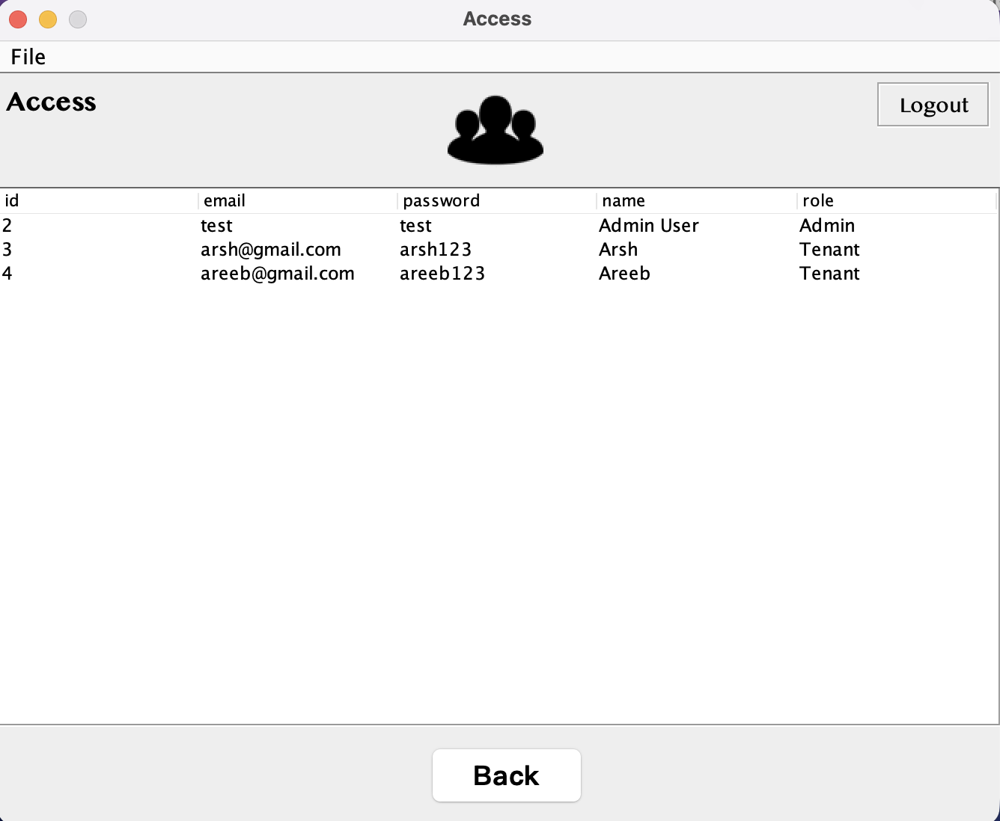
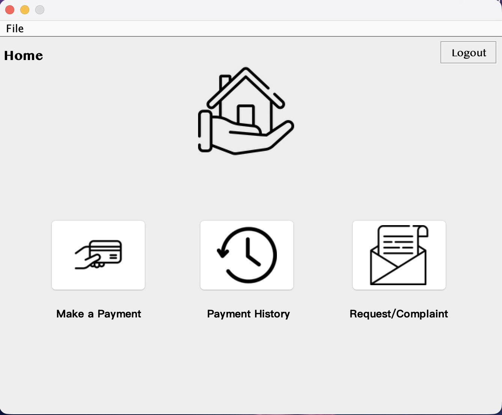

# Property Management System

## Description
A desktop-based Property Management System built in Java that supports both administrators and tenants. The system features role-based authentication, tenant management, access control, and secure data handling through a clean and intuitive graphical user interface. It is designed to streamline property-related operations such as onboarding tenants, managing access roles, and viewing tenant information.

---

## Features

### Admin
- Secure login system  
- Add new tenants  
- Update and delete tenant records  
- View all tenants  
- Add new access roles  
- Manage user access and permissions  
- View all registered users  
- Role-based dashboard navigation  

### Tenant
- Secure login system  
- Tenant-specific home dashboard  
- View personal details  
- Make payments  
- View payment history  
- Submit requests or complaints  

---

## Tech Stack
- **Language:** Java  
- **UI Framework:** Swing  
- **Database:** MySQL (MySQL Workbench)  
- **IDE:** NetBeans  
- **Build Tool:** Apache Ant  

---

## How to Run

1. Clone or download this repository
2. Open the project in NetBeans
3. Make sure MySQL is running
4. Import the provided SQL database (if included)
5. Update the database credentials inside the database connection file
6. Click the **Run** button in NetBeans

---

## Database Setup

1. Open MySQL Workbench
2. Create a new schema
3. Import the provided `.sql` file
4. Update the connection details in the Java database connection class

---

## User Roles

| Role   | Permissions |
|--------|------------|
| Admin  | Full system access, tenant management, access control |
| Tenant | Limited access, payment features, personal dashboard |

---

## Screenshots

### Login Page

### Admin Dashboard

### Add Tenant

### Manage Tenant

### Access Management

### Tenant Dashboard

### Tenant Dashboard

